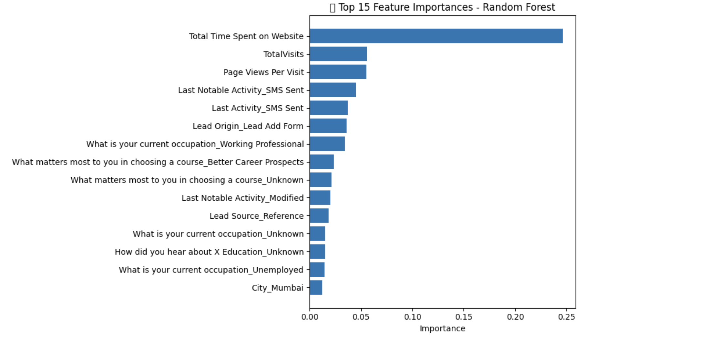

# B2B Lead Conversion Prediction

_A Machine Learning Approach to Lead Scoring_

This project analyzes lead conversion data to build a predictive model that estimates the likelihood of a lead converting in a B2B education services context. It combines exploratory data analysis, feature engineering, and machine learning modeling to support sales teams in prioritizing high-quality leads.

---

##  Objective

To develop a **lead scoring model** that classifies whether a lead is likely to convert based on behavioral and demographic attributes. This model aims to support business and marketing teams in targeting the most promising leads.

---

##  Key Machine Learning Techniques

- **Preprocessing:** Missing value imputation, one-hot encoding for categorical variables  
- **Modeling:** Trained and evaluated three algorithms:
  - Logistic Regression
  - Random Forest
  - XGBoost (best-performing)
- **Evaluation Metrics:** Accuracy, Precision, Recall, F1-Score, ROC-AUC
- **Explainability:** Feature Importance & SHAP Values

---

##  Dataset Overview

- ~9,240 lead records with 36 input features  
- Features include:
  - **Behavioral Data:** Website visits, time spent on site, last activity  
  - **Demographics:** Occupation, city, specialization  
  - **Source Tracking:** Lead source, lead origin, ads clicked  

---

##  Model Performance

| Model                | Accuracy | ROC-AUC |
|---------------------|----------|---------|
| Logistic Regression | 80%      | 0.8778  |
| Random Forest       | 81%      | 0.8779  |
| **XGBoost**         | **82%**  | **0.8895** 

---

##  Key Findings

###  Top Predictive Features
From feature importance and SHAP analysis, we found that the strongest predictors of conversion were:
- **Total Time Spent on Website** – the longer a lead spends, the higher the likelihood of conversion  
- **TotalVisits** and **Page Views Per Visit** – strong indicators of lead engagement  
- **Recent SMS Activity** – both `Last Activity` and `Last Notable Activity` involving SMS were highly predictive  
- **Lead Source and Lead Origin** – certain entry points (like “Lead Add Form”) were more effective  
- **Occupation** – working professionals showed higher conversion rates

 Feature Importance (Random Forest)  

 SHAP Summary Plot (XGBoost)  

---

##  Next Steps

This project focused on training and evaluating a lead scoring model to identify high-potential leads based on past data. Here are a few recommended next steps to expand its practical utility:

 ** Streamlit Web App (UI Integration)**
   - Build a lightweight Streamlit app that allows users to input new lead details and get real-time predictions on conversion likelihood.
   - Useful for sales reps and marketing teams who want instant insights without technical expertise.

